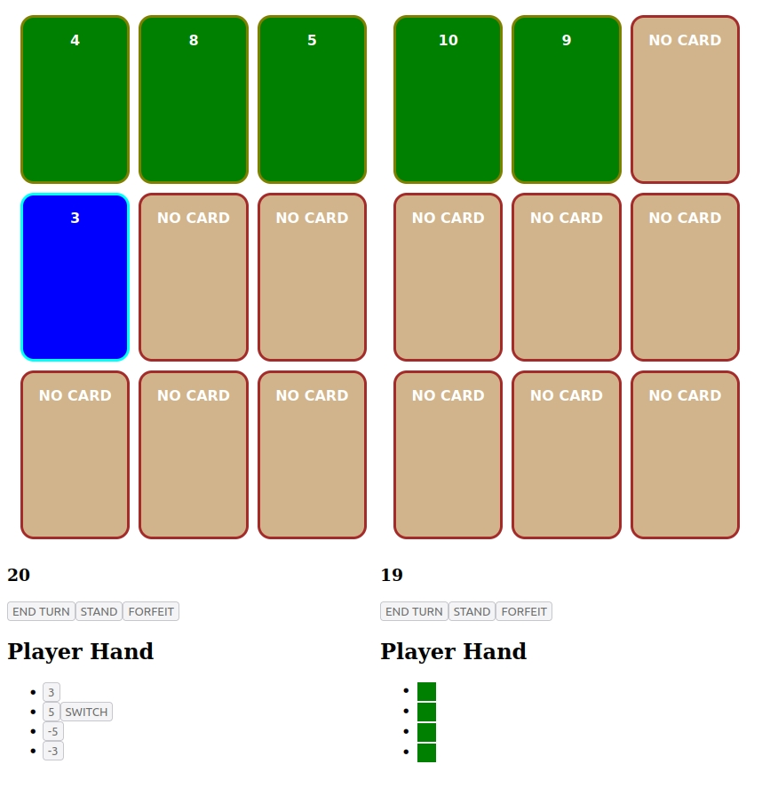

# Pure Pazaak

Pazaak from Star Wars: Knights of the Old Republic! At the moment, only playable local with two players.

This project was bootstrapped with [Create React App](https://github.com/facebook/create-react-app).

## Rules of the Game ([from wiki](https://starwars.fandom.com/wiki/Pazaak/Legends))

Four ways to win the set:

1. Outscoring After both players choose to stand, the player with the score closest to but not over 20 would win.

2. Going bust: If a player ends their turn with a score over 20, they are said to "bust," and the other player wins.

3. Filling the table: In some rare occasions, if a player places 9 cards on the table without busting, the player would automatically win if their score ens up being 20 or under.

4. Using the tiebreaker card: A golden tiebreaker card, when used last, brings victory to the user if both players have the same score. (NOT YET IMPLEMENTED!)
